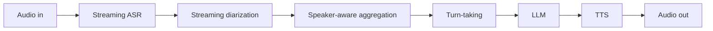
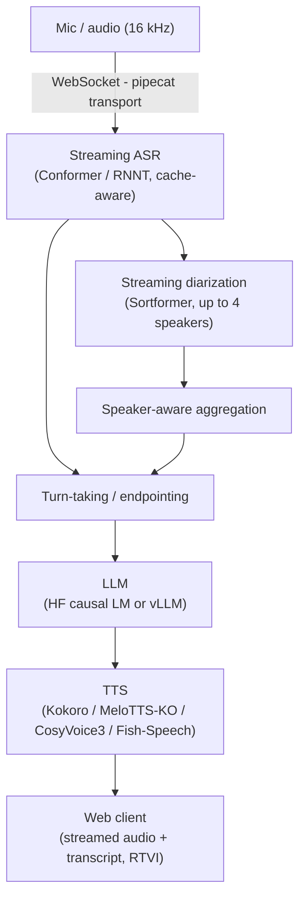

# nemo-voice-agent-ko

A real-time, full-duplex **Korean voice agent** built on [NVIDIA NeMo](https://github.com/NVIDIA-NeMo/NeMo) and the [pipecat](https://github.com/pipecat-ai/pipecat) orchestration framework. It connects streaming ASR, streaming speaker diarization, speaker-aware aggregation, turn-taking, an LLM, and Korean TTS into a single low-latency pipeline, served over WebSocket with a web client.

  

> Personal research / proof-of-concept that extends NVIDIA NeMo's voice-agent example with Korean streaming recognition, multi-speaker handling, and Korean TTS backends. Every model referenced is public; model paths in the configs are `/path/to/...` placeholders that you fill in.

## Overview

Audio flows through the pipeline incrementally, so the user hears partial results at conversational latency:



The system runs as a FastAPI WebSocket server plus a TypeScript/Vite web client, and supports six independently selectable modes (from STT-only to full duplex).

## Key features

- Cache-aware streaming ASR (Korean + multilingual), via a 5-file NeMo-core patch (`patches/`).
- Streaming speaker diarization (`nvidia/diar_streaming_sortformer_4spk-v2`, up to 4 speakers).
- Speaker-aware aggregation: merges ASR + diarization into multi-speaker transcripts.
- Turn-taking and Korean backchannel handling for natural barge-in.
- Pluggable LLM: any Hugging Face causal LM, locally or via a vLLM server.
- Multi-backend Korean TTS: Kokoro, MeloTTS-Korean, CosyVoice3, Fish-Speech / OpenAudio.
- Six operating modes from one server (STT/LLM/TTS in any sensible combination).
- Runtime reconfiguration of VAD / aggregator / STT / diarization without a restart.
- Web client with a per-speaker transcript UI and module/model badges.

## How this differs from the upstream NeMo voice-agent example

| Capability | Upstream example | This repo |
|---|---|---|
| Cache-aware streaming Conformer/RNNT | — | 5-file NeMo-core patch (mask/cache dims + multilingual language tokens) |
| Streaming speaker diarization | — | Sortformer, up to 4 speakers, online |
| Speaker-aware transcript aggregation | — | multi-speaker, boundary-aware |
| Korean TTS backends | — | Kokoro / MeloTTS-KO / CosyVoice3 / Fish-Speech |
| Operating modes | single | 6 selectable modes |
| Runtime reconfiguration | — | live VAD / aggregator / STT / diar |
| Web client speaker UI | basic | per-speaker colors + module/model badges |

## Architecture



## Repository layout

```
nemo/agents/voice_agent/          # NeMo namespace package (the voice-agent library)
  pipecat/services/nemo/          #   streaming_asr, streaming_diar, stt, tts, llm,
                                  # diar, turn_taking, speaker_aware_aggregator, ...
  pipecat/processors/             #   display + RTVI (speaker-aware) processors
  pipecat/transports/             #   WebSocket server transport
  pipecat/frames/ , config/ , utils/
examples/voice_agent/             # runnable example
  server/                         #   FastAPI + WebSocket server, 6-mode configs
  client/                         #   TypeScript/Vite web client
  scripts/ , *.sh                 #   launch / TTS helper scripts
  README.md, SETUP_GUIDE.md, TROUBLESHOOTING.md   # in-depth docs
patches/nemo-streaming-asr.patch  # NeMo-core changes for cache-aware streaming ASR
```

## Requirements

- Linux with an NVIDIA GPU (CUDA 12.x). A single 24 GB GPU runs the smaller modes; the full pipeline (LLM + STT + TTS + diarization) needs roughly 24 GB or more.
- Python 3.10+ and Node.js 20+ (for the web client).
- `ffmpeg` and `espeak-ng` (used by some TTS backends).

## Installation

```bash
# 1. Python dependencies (NeMo, pipecat, vLLM, etc.)
pip install -r examples/voice_agent/requirements.txt
# Conda alternative:
# conda env create -f examples/voice_agent/environment.yaml && conda activate nemo-voice

# 2. Apply the streaming-ASR patch to your NeMo source checkout
cd /path/to/your/NeMo
git apply /path/to/nemo-voice-agent-ko/patches/nemo-streaming-asr.patch
cd -

# 3. Web client dependencies
cd examples/voice_agent/client && npm install && cd -
```

`requirements.txt` is the canonical dependency set. See `examples/voice_agent/SETUP_GUIDE.md` for a full environment walkthrough.

## Models

All defaults are public and listed in `examples/voice_agent/server/model_registry.yaml`. You point the configs at these (NeMo/HF download them on first use) or at your own local checkpoints.

| Stage | Default public model(s) |
|---|---|
| Streaming ASR | `stt_en_fastconformer_hybrid_large_streaming_80ms` (or your Korean streaming NeMo model) |
| Diarization | `nvidia/diar_streaming_sortformer_4spk-v2` |
| LLM | `nvidia/NVIDIA-Nemotron-Nano-9B-v2`, `meta-llama/Llama-3.1-8B-Instruct`, `Qwen/Qwen2.5-7B-Instruct`, `Qwen/Qwen3-8B` |
| TTS | `fastpitch-hifigan`, `hexgrad/Kokoro-82M`, MeloTTS-Korean, CosyVoice3, Fish-Speech |

Model paths live in `examples/voice_agent/server/server_configs/`. Each `*_mode.yaml` references the per-component files under `stt_configs/`, `llm_configs/`, `tts_configs/`. Replace any `/path/to/...` value with a model name or a local path before running that component.

## Running the agent (step by step)

The launcher `run_voice_agent.sh` starts the server and the web client together.

```bash
cd examples/voice_agent
chmod +x run_voice_agent.sh stop_voice_agent.sh        # first time only
```

**Step 1 - Start with STT-only (no LLM/TTS needed).** This is the simplest first run: it transcribes your microphone in real time.

```bash
./run_voice_agent.sh -m stt-only
```

**Step 2 - Open the web client.** The launcher starts the Vite dev server; open the printed URL (default <http://localhost:5173>). Allow microphone access and start speaking — partial transcripts appear live.

**Step 3 - Scale up to the full agent.** Edit `server/server_configs/stt_llm_tts_mode.yaml` so the STT / LLM / TTS entries point at real models (see the table above), then:

```bash
./run_voice_agent.sh -m full          # STT + LLM + TTS, self-contained (FastPitch/Kokoro TTS)
```

**Step 4 - Stop everything.**

```bash
./stop_voice_agent.sh
```

Useful launcher options (`./run_voice_agent.sh -h` for all):

| Option | Meaning |
|---|---|
| `-m <mode>` | `stt-only`, `llm-only`, `tts-only`, `stt-llm`, `llm-tts`, `full` |
| `-c <path>` | use a specific server config YAML |
| `--server-only` / `--client-only` | run just one side |
| `--build-client` | production-build the client before serving |
| `--client-port` / `--server-port` / `--api-port` | ports (defaults 5173 / 8765 / 7860) |

### Manual launch (alternative)

```bash
# Terminal 1 - server
SERVER_CONFIG_PATH=./server/server_configs/stt_only_mode.yaml python ./server/server.py
# Terminal 2 - client
cd client && npm run dev
```

## Operating modes

| Mode | Config | STT | LLM | TTS | In -> Out |
|---|---|:--:|:--:|:--:|---|
| Full | `stt_llm_tts_mode.yaml` | yes | yes | yes | voice -> voice |
| STT + LLM | `stt_llm_mode.yaml` | yes | yes | — | voice -> text |
| STT-only | `stt_only_mode.yaml` | yes | — | — | voice -> text |
| LLM + TTS | `llm_tts_mode.yaml` | — | yes | yes | text -> voice |
| LLM-only | `llm_only_mode.yaml` | — | yes | — | text -> text |
| TTS-only | `tts_only_mode.yaml` | — | — | yes | text -> voice |

`default.yaml` is the full pipeline routed through the Fish-Speech / OpenAudio API (needs a separate API server on port 8080). For a self-contained full run, use `stt_llm_tts_mode.yaml`. The full configuration reference is in `examples/voice_agent/README.md`.

## Command-line clients

For testing without a browser:

```bash
python examples/voice_agent/text_client.py                          # text input modes
python examples/voice_agent/audio_file_client.py --file sample.wav  # stream a file into the agent
```

## Example output

Server start (STT-only):

```
INFO | Loading NeMo cache-aware streaming ASR ...
INFO | STT service initialized (Conformer/RNNT, chunk streaming)
INFO | Starting websocket server on 0.0.0.0:8765
```

Command-line text client:

```
[You]        안녕하세요, 오늘 날씨가 어때요?
[Assistant]  안녕하세요. 저는 실시간 날씨를 직접 확인할 수는 없지만,
             지역을 알려주시면 이어서 도와드릴게요.
```

## The streaming-ASR core patch

`patches/nemo-streaming-asr.patch` turns the NeMo Conformer/RNNT encoder into a correct cache-aware streaming encoder and adds multilingual language-token support. It touches five core files (`conformer_encoder.py`, `multi_head_attention.py`, `conformer_modules.py`, `causal_convs.py`, `rnnt.py`). See `patches/README.md` for what changes and how to apply it.

## Tests

```bash
pytest examples/voice_agent/tests/test_config_manager.py
```

## Troubleshooting

Common first-run issues (CUDA OOM, model download, WebSocket/HTTPS, port conflicts) are covered in `examples/voice_agent/TROUBLESHOOTING.md`.

## License and attribution

Apache-2.0 (see `LICENSE`). Builds on and extends [NVIDIA NeMo](https://github.com/NVIDIA-NeMo/NeMo) (Apache-2.0) and uses [pipecat](https://github.com/pipecat-ai/pipecat). ASR, diarization, TTS, and LLM models are the property of their respective authors.

## Acknowledgements

NVIDIA NeMo (ASR, Sortformer diarization, TTS), the pipecat framework, and the open-source Korean TTS / LLM model authors.
