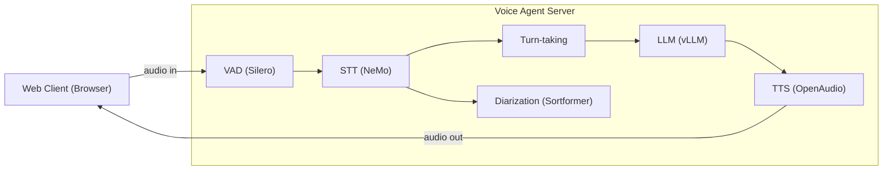
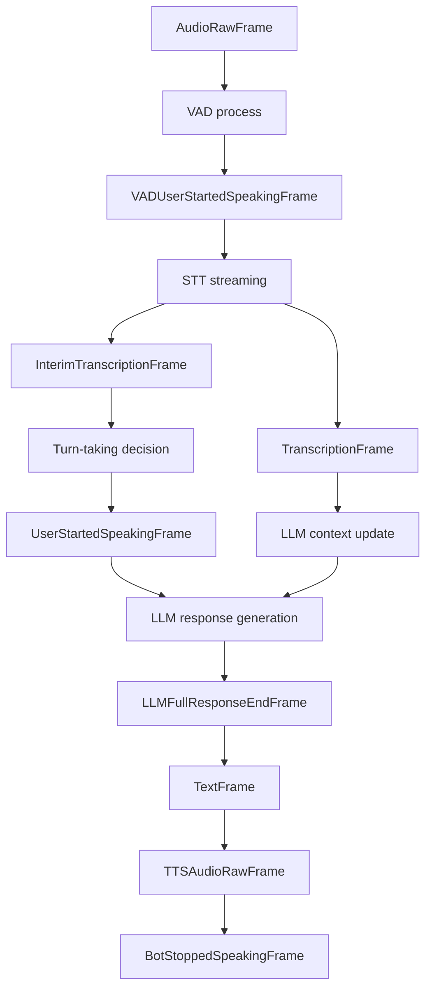
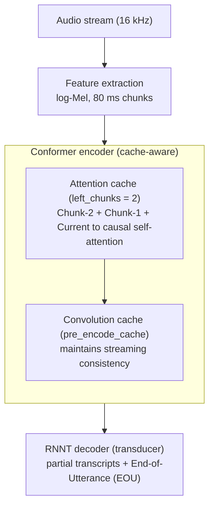
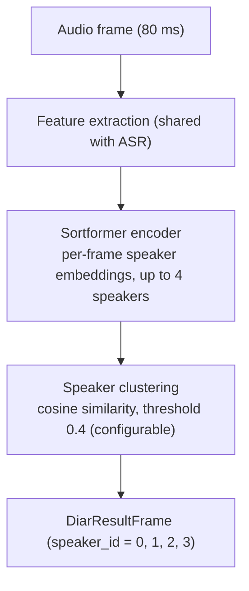
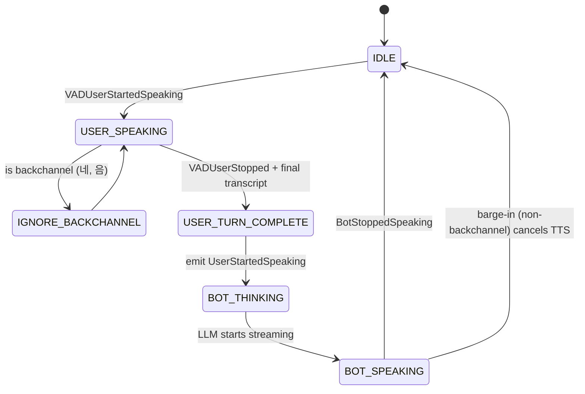
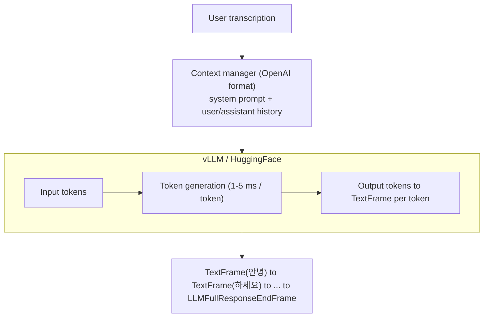
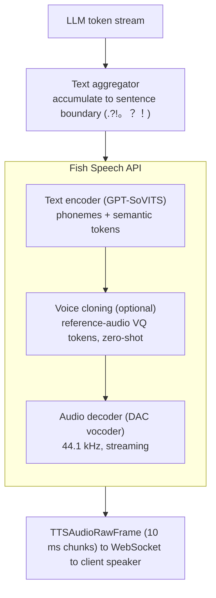
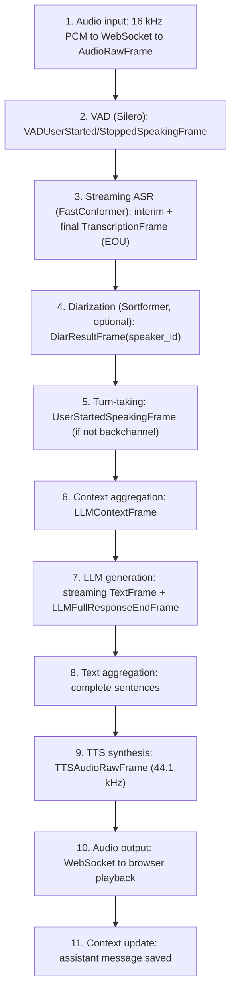
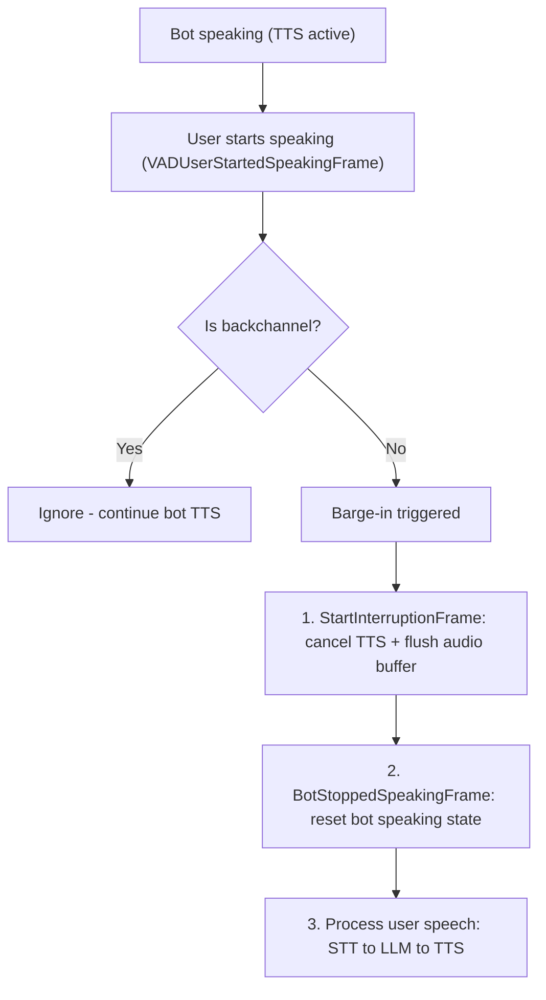

# NeMo Voice Agent - Technical Guide

> Comprehensive technical documentation for the NeMo Voice Agent pipeline

This document provides in-depth technical details about the voice agent architecture, pipeline components, and operation modes.

## Table of Contents

- [Quick Start](#quick-start)
- [Architecture Overview](#architecture-overview)
- [Pipeline Components](#pipeline-components)
  - [Voice Activity Detection (VAD)](#voice-activity-detection-vad)
  - [Streaming Speech-to-Text (STT)](#streaming-speech-to-text-stt)
  - [Speaker Diarization](#speaker-diarization)
  - [Turn-Taking Manager](#turn-taking-manager)
  - [Large Language Model (LLM)](#large-language-model-llm)
  - [Text-to-Speech (TTS)](#text-to-speech-tts)
- [Data Flow](#data-flow)
- [Operation Modes](#operation-modes)
  - [CLI Text Client](#cli-text-client)
  - [CLI Audio File Client](#cli-audio-file-client)
- [Interruption & Barge-in](#interruption--barge-in)
- [Configuration Reference](#configuration-reference)
- [Troubleshooting](#troubleshooting)
- [API Reference](#api-reference)

---

## Quick Start

### One-Command Launch

Use the provided wrapper scripts to start the Voice Agent with a single command:

```bash
cd examples/voice_agent

# Make scripts executable (first time only)
chmod +x run_voice_agent.sh stop_voice_agent.sh

# Run with predefined mode
./run_voice_agent.sh -m stt-only          # STT-Only mode
./run_voice_agent.sh -m llm-only          # LLM-Only mode (text input)
./run_voice_agent.sh -m full              # Full mode (STT+LLM+TTS)

# Run with custom config file
./run_voice_agent.sh -c ./server/server_configs/korean_voice_agent_fish_speech_api.yaml

# List available configurations
./run_voice_agent.sh -l
```

### Script Options

| Option | Description |
|--------|-------------|
| `-c, --config <path>` | Path to server config YAML file |
| `-m, --mode <mode>` | Predefined mode: `stt-only`, `llm-only`, `tts-only`, `stt-llm`, `llm-tts`, `full` |
| `--server-only` | Run only the server (no client) |
| `--client-only` | Run only the client (no server) |
| `--build-client` | Build client before running |
| `-l, --list-configs` | List available config files |
| `-h, --help` | Show help message |

### Stop Voice Agent

```bash
# Stop all Voice Agent processes
./stop_voice_agent.sh

# Stop server only
./stop_voice_agent.sh --server

# Force kill (if processes don't stop gracefully)
./stop_voice_agent.sh -f
```

### Manual Launch (Alternative)

If you prefer manual control:

```bash
# Terminal 1: Start server
cd examples/voice_agent
export SERVER_CONFIG_PATH="./server/server_configs/stt_only_mode.yaml"
python ./server/server.py

# Terminal 2: Start client
cd examples/voice_agent/client
npm install  # first time only
npm run dev
```

Then open `http://localhost:5173` in your browser.

---

## Architecture Overview

The NeMo Voice Agent implements a full-duplex conversational AI system with streaming audio processing. The architecture is built on top of [Pipecat](https://github.com/pipecat-ai/pipecat), an open-source orchestration framework for real-time AI pipelines.

### High-Level Architecture



### Frame-Based Pipeline

The pipeline uses a **frame-based architecture** where each component processes and emits frames:



---

## Pipeline Components

### Voice Activity Detection (VAD)

The VAD component detects when the user starts and stops speaking, enabling proper turn-taking.

#### Implementation: Silero VAD

```python
# Configuration in default.yaml
vad:
  type: silero
  confidence: 0.6      # Detection threshold (0.0-1.0)
  start_secs: 0.1      # Minimum speech duration to trigger start
  stop_secs: 0.6       # Silence duration to trigger stop
  min_volume: 0.4      # Minimum audio volume threshold
```

#### Frame Emissions

| Input Frame | Output Frame | Condition |
|-------------|--------------|-----------|
| `AudioRawFrame` | `VADUserStartedSpeakingFrame` | Voice detected above threshold |
| `AudioRawFrame` | `VADUserStoppedSpeakingFrame` | Silence exceeds `stop_secs` |

#### Tuning Guidelines

- **Fast Response**: Reduce `stop_secs` (0.4-0.6s) for quicker turn-taking
- **Noisy Environment**: Increase `confidence` (0.7-0.8) and `min_volume` (0.5-0.6)
- **Natural Conversation**: Increase `stop_secs` (0.8-1.2s) to allow natural pauses

---

### Streaming Speech-to-Text (STT)

The STT component uses **cache-aware streaming FastConformer** for real-time transcription with sub-100ms latency.

#### Cache-Aware Streaming Architecture



#### Configuration

```yaml
stt:
  type: nemo
  model: "/path/to/FastConformer-0.8B.nemo"
  model_config: "./server_configs/stt_configs/nemo_cache_aware_streaming.yaml"
  device: "cuda:0"

  # Token filtering for display
  filter_display_tokens:
    - "<lan_ko>"    # Korean language token
    - "<lan_en>"    # English language token
    # ... other language tokens

  # LLM receives raw text with tokens
  preserve_raw_for_llm: true
  extract_language_info: true
```

#### Streaming Parameters

| Parameter | Default | Description |
|-----------|---------|-------------|
| `frame_len_in_secs` | 0.08 | Audio chunk size (80ms) |
| `att_context_size` | [70, 1] | [left_context, right_context] for attention |
| `left_chunks` | 2 | Number of cached chunks for attention |
| `chunk_size_in_secs` | 0.08 | Processing chunk duration |

#### Output Format

```python
TranscriptionFrame(
    text="안녕하세요",           # Filtered display text
    language=Language.KO,
    timestamp=...,
    result={
        "raw_text": "<lan_ko>안녕하세요",  # Original with tokens
        "detected_language": "ko",          # Extracted language
        "eou_prob": 0.95,                   # End-of-utterance probability
    }
)
```

---

### Speaker Diarization

The diarization component identifies different speakers in multi-speaker conversations.

#### Streaming SortFormer Architecture



#### Configuration

```yaml
diar:
  type: nemo
  enabled: true
  model: "nvidia/diar_streaming_sortformer_4spk-v2"
  device: "cuda:0"
  threshold: 0.4          # Speaker detection threshold
  frame_len_in_secs: 0.08 # Must match STT frame length
```

#### Speaker-Aware Aggregation (STT-Only Mode)

```yaml
speaker_aggregator:
  max_speakers: 4
  use_speaker_boundary: true    # New line on speaker change
  use_vad_boundary: true        # New line on VAD stop
  min_words_for_speaker_commit: 1
  console_display: true         # Color-coded console output
```

---

### Turn-Taking Manager

The turn-taking component manages conversation flow, handling barge-in and backchannel phrases.

#### Turn-Taking State Machine



#### Configuration

```yaml
turn_taking:
  backchannel_phrases_path: "./server/backchannel_phrases.yaml"
  max_buffer_size: 2       # Words before instant interrupt
  bot_stop_delay: 0.1      # Delay after bot stops speaking
```

#### Backchannel Phrases (Korean)

```yaml
# server/backchannel_phrases.yaml
# Positive affirmations
- "네"
- "네네"
- "응"
- "그래"
- "맞아"

# Listening signals
- "음"
- "어"
- "아"

# Understanding confirmations
- "알겠어"
- "그렇구나"
- "그래요"
```

---

### Large Language Model (LLM)

The LLM component generates responses based on conversation context.

#### Streaming Generation Flow



#### Configuration

```yaml
llm:
  enabled: true
  type: hf                    # or "vllm" for vLLM backend
  model: "/path/to/llm_model"
  model_config: "./server_configs/llm_configs/hf_llm_generic.yaml"
  device: "cuda:0"
  max_tokens: 512
  temperature: 0.7
  enable_reasoning: false     # Set true for thinking mode

  system_prompt: |
    당신은 AI 음성 어시스턴트입니다.
    자연스러운 대화체로 응답하세요.
```

#### Response Normalization

The LLM output is normalized before TTS:
- Remove extra whitespace between tokens
- Handle Korean syllable boundaries
- Filter thinking tokens (`<think>`, `</think>`)

---

### Text-to-Speech (TTS)

The TTS component converts LLM responses to natural speech with optional voice cloning.

#### TTS Streaming Architecture



#### Configuration

```yaml
tts:
  enabled: true
  type: fish_speech_api      # Recommended for low latency
  api_url: "http://localhost:8080"
  device: "cuda:0"

  # Voice cloning (optional)
  reference_audio_path: "/path/to/voice.wav"      # 10-30 seconds
  reference_audio_text: "Reference audio transcript..."

  # Sentence segmentation
  extra_separator:
    - '\n'
    - "."
    - "?"
    - "!"
    - "。"   # Korean/Japanese full stop

  # Thinking token filtering
  think_tokens: ["<think>", "</think>"]
```

#### TTS Service Options

| Service | Sample Rate | Voice Cloning | Latency | Notes |
|---------|-------------|---------------|---------|-------|
| `fish_speech_api` | 44.1kHz | Yes | ~1-3s | Recommended for Korean |
| `fish_speech` | 44.1kHz | Yes | ~30-100s | Subprocess mode |
| `kokoro` | 24kHz | No | <1s | English, lightweight |
| `melo_korean` | 44.1kHz | No | ~2-5s | Korean |
| `nemo` | 22kHz | No | <1s | FastPitch+HiFiGAN |

#### Zero-Shot Voice Cloning

OpenAudio S1-Mini (Fish Speech API) supports zero-shot voice cloning with just a short reference audio sample.

**Using Reference Audio File:**
```yaml
tts:
  type: fish_speech_api
  api_url: "http://localhost:8080"

  # Voice cloning with reference audio
  reference_audio_path: "/path/to/reference_voice.wav"   # 10-30 seconds recommended
  reference_audio_text: |
    안녕하세요. 저는 AI 어시스턴트입니다.
    무엇을 도와드릴까요?

  # When reference_audio_text is empty, Fish Speech auto-transcribes
  # reference_audio_text: ""
```

**Using Pre-registered Voice ID:**
```yaml
tts:
  type: fish_speech_api
  api_url: "http://localhost:8080"

  # Use voice registered on Fish Speech server
  reference_id: "custom_voice_01"

  # Optional: Combine with reference audio for better quality
  reference_audio_path: null
  reference_audio_text: null
```

**With Memory Cache Enabled:**
```yaml
tts:
  type: fish_speech_api
  api_url: "http://localhost:8080"
  reference_audio_path: "/path/to/reference_voice.wav"
  reference_audio_text: "Reference transcript..."

  # Enable memory cache for faster repeated synthesis
  use_memory_cache: "on"
```

**Best Practices for Reference Audio:**
- Duration: 10-30 seconds of clean speech
- Quality: Clear audio without background noise
- Content: Natural speech with varied intonation
- Format: WAV format recommended (16kHz+ sample rate)

---

## Data Flow

### Complete Pipeline Flow (Full Mode)



### Latency Breakdown

| Stage | Typical Latency | Notes |
|-------|-----------------|-------|
| Audio Input → VAD | 10-50ms | Silero processing |
| VAD → ASR | 80ms | Chunk size |
| ASR Processing | 20-50ms | Per chunk |
| Turn-taking | <10ms | State machine |
| LLM First Token | 100-500ms | Model-dependent |
| LLM Streaming | 10-50ms/token | vLLM optimized |
| TTS First Chunk | 500-2000ms | Voice cloning overhead |
| TTS Streaming | 10ms/chunk | Continuous |
| **Total (First Response)** | **~1-3 seconds** | End-to-end |

---

## Operation Modes

### Mode Configuration Matrix

| Mode | Config File | STT | LLM | TTS | Input | Output |
|------|-------------|-----|-----|-----|-------|--------|
| **Full** | `stt_llm_tts_mode.yaml` | ✅ | ✅ | ✅ | Voice | Voice |
| **STT+LLM** | `stt_llm_mode.yaml` | ✅ | ✅ | ❌ | Voice | Text |
| **STT-Only** | `stt_only_mode.yaml` | ✅ | ❌ | ❌ | Voice | Text |
| **LLM+TTS** | `llm_tts_mode.yaml` | ❌ | ✅ | ✅ | Text | Voice |
| **LLM-Only** | `llm_only_mode.yaml` | ❌ | ✅ | ❌ | Text | Text |
| **TTS-Only** | `tts_only_mode.yaml` | ❌ | ❌ | ✅ | Text | Voice |

> `default.yaml` is the same full pipeline but routes TTS through the **Fish-Speech / OpenAudio API** (requires a separately launched API server on port 8080). For a self-contained full run, use `stt_llm_tts_mode.yaml` (FastPitch/Kokoro TTS).

### Pipeline Construction Per Mode

#### Full Mode (STT+LLM+TTS)

```python
pipeline = [
    ws_transport.input(),
    rtvi,                           # RTVI Protocol Handler
    stt,                            # NeMo STT Service
    diar,                           # Speaker Diarization (optional)
    turn_taking,                    # Turn-Taking Manager
    display_processor,              # Console Display
    user_context_aggregator,        # User Context
    llm,                            # LLM Service
    tts,                            # TTS Service
    ws_transport.output(),
    assistant_context_aggregator,   # Assistant Context
]
```

#### Text Input Modes (LLM-Only, TTS-Only, LLM+TTS)

```python
# Text input via RTVI action: text_input:send
pipeline = [
    ws_transport.input(),
    rtvi,                           # Handles text_input:send action
    # (No VAD, STT, Turn-Taking)
    display_processor,
    user_context_aggregator,        # (LLM modes only)
    llm,                            # (LLM modes only)
    tts,                            # (TTS modes only)
    ws_transport.output(),
    assistant_context_aggregator,   # (LLM modes only)
]
```

### Starting Different Modes

```bash
# Full Mode (default)
python ./server/server.py

# STT+LLM Mode (voice input, text output)
SERVER_CONFIG_PATH=./server/server_configs/stt_llm_mode.yaml \
python ./server/server.py

# STT-Only Mode (transcription service)
SERVER_CONFIG_PATH=./server/server_configs/stt_only_mode.yaml \
python ./server/server.py

# LLM+TTS Mode (text input, voice output)
SERVER_CONFIG_PATH=./server/server_configs/llm_tts_mode.yaml \
python ./server/server.py

# LLM-Only Mode (text chatbot)
SERVER_CONFIG_PATH=./server/server_configs/llm_only_mode.yaml \
python ./server/server.py

# TTS-Only Mode (text-to-speech service)
SERVER_CONFIG_PATH=./server/server_configs/tts_only_mode.yaml \
python ./server/server.py
```

### CLI Text Client

For text input modes (LLM-Only, TTS-Only, LLM+TTS), you can use the command-line text client instead of the web browser:

```bash
# Start server in LLM-Only mode
SERVER_CONFIG_PATH=./server/server_configs/llm_only_mode.yaml python ./server/server.py

# In another terminal, run the CLI text client
python text_client.py
```

The CLI client provides a premium terminal interface with:
- Real-time streaming text output
- Intelligent text normalization
- Color-coded visual indicators
- Commands: `help`, `status`, `config`, `clear`, `quit`


**Example Interaction:**
```
● [LLM] ▶ 안녕하세요, 오늘 날씨가 어때요?

  15:30:45 [You] #1
  ────────────────────────────────────────
  안녕하세요, 오늘 날씨가 어때요?

  15:30:46 [Assistant]
  ────────────────────────────────────────
  안녕하세요! 저는 AI 어시스턴트라서 실시간 날씨 정보를 직접 확인할 수 없습니다.
  현재 계신 지역의 날씨를 알려주시면 대화를 이어갈 수 있어요.
```

### Web Audio File Upload

For audio input modes (STT-Only, STT+LLM, Full Voice Agent), you can upload audio files directly through the web browser interface, similar to how text input modes accept text via the browser.

#### Use Cases

- **No Microphone Available**: Upload pre-recorded audio when microphone access is unavailable
- **Batch Testing**: Process multiple audio files without real-time recording
- **Quality Control**: Use high-quality studio recordings for consistent testing
- **Remote Access**: Upload audio from any device without microphone permissions


#### How to Use

1. **Switch to File Mode**: In the STT-Only web interface, click the "File" toggle in the INPUT panel header
2. **Upload Audio**: Drag and drop an audio file or click to browse
3. **Preview Waveform**: View the audio waveform visualization with playback controls
4. **Start Streaming**: Click the "Start" button to begin processing
5. **Monitor Progress**: Watch real-time transcription in the conversation area

#### Supported Formats

| Format | Extension | Notes |
|--------|-----------|-------|
| WAV | `.wav` | Recommended, best quality |
| MP3 | `.mp3` | Compressed, widely compatible |
| OGG | `.ogg` | Open format |
| FLAC | `.flac` | Lossless compression |
| WebM | `.webm` | Web-native format |

#### Streaming Options

| Option | Description |
|--------|-------------|
| **Playback Speed** | Adjust streaming speed (0.5x - 2.0x) |
| **Sync Playback** | Enable synchronized audio playback while streaming |
| **Progress Bar** | Visual indicator of streaming progress |

#### Comparison with Text Input Modes

| Mode | Input Type | Use Case |
|------|------------|----------|
| **TTS-Only** | Text (Browser) | Text-to-speech synthesis |
| **LLM-Only** | Text (Browser) | Text chatbot without voice |
| **LLM+TTS** | Text (Browser) | Text input with voice output |
| **STT-Only** | Audio File / Microphone | Speech transcription |
| **STT+LLM** | Audio File / Microphone | Voice input with text output |
| **Full Mode** | Audio File / Microphone | Complete voice agent |

> **Note**: Audio file upload is available in all voice input modes. The file is streamed in real-time, simulating microphone input, so the server processes it identically to live audio.

---

### CLI Audio File Client

For audio input modes (STT-Only, STT+LLM, Full Voice Agent), you can stream audio files instead of using a microphone. This is perfect for testing and batch processing.

```bash
# Start server in STT-Only mode
SERVER_CONFIG_PATH=./server/server_configs/stt_only_mode.yaml python ./server/server.py

# In another terminal, stream an audio file
python audio_file_client.py --file test_audio.wav
```

#### Features

- **Real-time streaming**: Simulates microphone input at native playback rate
- **Adjustable speed**: Use `--speed 2.0` for faster testing
- **Professional output**: Clean CLI display with numbered transcription entries
- **Session statistics**: Word count, entry count, and full transcription summary
- **Protobuf serialization**: Same protocol as browser client

#### Command Line Options

| Option | Default | Description |
|--------|---------|-------------|
| `--file`, `-f` | (required) | Path to WAV audio file |
| `--host` | localhost | Server host address |
| `--port` | 8765 | Server WebSocket port |
| `--speed` | 1.0 | Playback speed multiplier |
| `--chunk-ms` | 16 | Audio chunk size in milliseconds |
| `--verbose`, `-v` | false | Show verbose debug output |

#### Usage Examples

```bash
# Normal real-time streaming
python audio_file_client.py --file test_audio.wav

# 2x speed for faster testing
python audio_file_client.py --file test_audio.wav --speed 2.0

# Connect to remote server
python audio_file_client.py --file test_audio.wav --host 10.0.0.1 --port 8765

# Verbose mode for debugging
python audio_file_client.py --file test_audio.wav --verbose
```

#### Example Output

```
╔══════════════════════════════════════════════════════════════╗
║  Audio File Client - STT Testing Tool                         ║
║  Streaming audio file to Voice Agent server                   ║
╚══════════════════════════════════════════════════════════════╝

  ──────────────────────────────────────────────────────────
  SESSION STARTED
  ──────────────────────────────────────────────────────────

10:30:45.123 [✓] Connected to ws://localhost:8765
10:30:45.200 [ℹ] Streaming: test_audio.wav (44100Hz → 16000Hz)

  ──────────────────────────────────────────────────────────
  TRANSCRIPTION
  ──────────────────────────────────────────────────────────

  [001] 안녕하세요 반갑습니다.                           [.]
  [002] 오늘 날씨가 정말 좋네요.                         [.]
  [003] 저는 AI 어시스턴트입니다                         [|]

  ──────────────────────────────────────────────────────────
  SESSION SUMMARY
  ──────────────────────────────────────────────────────────

  Total entries: 3
  Total words: 12
  Duration: 5.2s

  Full transcription:
  ────────────────────────────────────────
  안녕하세요 반갑습니다. 오늘 날씨가 정말 좋네요. 저는 AI 어시스턴트입니다
  ────────────────────────────────────────
```

#### Reason Indicators

| Indicator | Meaning |
|-----------|---------|
| `[.]` | Sentence boundary (punctuation detected) |
| `[\|]` | VAD stop (voice activity ended) |
| `[▣]` | Stream end (file completed) |
| `[⋯]` | Max words (safety boundary) |

#### Audio Format Requirements

The client accepts WAV files with:
- Any sample rate (automatically resampled to 16kHz)
- Mono or stereo (stereo is downmixed to mono)
- 16-bit PCM encoding

---

## Interruption & Barge-in

### Interruption Handling Flow



### Backchannel Detection

Backchannel phrases (e.g., "네", "음", "그래") are detected and ignored during bot speaking:

```python
# Turn-taking service
def is_backchannel(self, text: str) -> bool:
    cleaned = self.clean_text(text)
    return cleaned in self.backchannel_phrases_nopc
```

### Interruption Configuration

```yaml
turn_taking:
  # Maximum words before instant interrupt (even if backchannel)
  max_buffer_size: 2

  # Delay after bot stops to allow clean transition
  bot_stop_delay: 0.1

  # Backchannel phrases file
  backchannel_phrases_path: "./server/backchannel_phrases.yaml"
```

---

## Configuration Reference

### Complete Configuration Schema

```yaml
# =============================================================================
# TRANSPORT CONFIGURATION
# =============================================================================
transport:
  audio_out_10ms_chunks: 4    # Number of 10ms chunks per output frame

# =============================================================================
# AUDIO QUALITY
# =============================================================================
audio:
  quality_mode: "high_quality"    # "high_quality" | "low_latency"
  output_sample_rate: "native"    # "native" | 16000 | 24000 | 44100

# =============================================================================
# VOICE ACTIVITY DETECTION
# =============================================================================
vad:
  type: silero
  confidence: 0.6             # Detection threshold (0.0-1.0)
  start_secs: 0.1             # Min duration to trigger start
  stop_secs: 0.6              # Silence duration for stop
  min_volume: 0.4             # Minimum audio volume

# =============================================================================
# SPEECH-TO-TEXT
# =============================================================================
stt:
  enabled: true               # Set false for text input modes
  type: nemo
  model: "path/to/model.nemo"
  model_config: "./server_configs/stt_configs/nemo_cache_aware_streaming.yaml"
  device: "cuda:0"

  filter_display_tokens:      # Tokens to hide from display
    - "<lan_ko>"
    - "<lan_en>"
  preserve_raw_for_llm: true  # Keep tokens for LLM context
  extract_language_info: true # Extract detected language

# =============================================================================
# SPEAKER DIARIZATION
# =============================================================================
diar:
  enabled: true               # Set false to disable
  type: nemo
  model: "nvidia/diar_streaming_sortformer_4spk-v2"
  device: "cuda:0"
  threshold: 0.4              # Speaker detection threshold
  frame_len_in_secs: 0.08     # Must match STT

# =============================================================================
# TURN-TAKING
# =============================================================================
turn_taking:
  backchannel_phrases_path: "./server/backchannel_phrases.yaml"
  max_buffer_size: 2          # Words before instant interrupt
  bot_stop_delay: 0.1         # Delay after bot stops

# =============================================================================
# LARGE LANGUAGE MODEL
# =============================================================================
llm:
  enabled: true               # Set false for STT-only modes
  type: hf                    # "hf" | "vllm" | "auto"
  model: "path/to/model"
  model_config: "./server_configs/llm_configs/model.yaml"
  device: "cuda:0"
  max_tokens: 512
  temperature: 0.7
  enable_reasoning: false

  system_prompt: |
    Your system prompt here...

# =============================================================================
# TEXT-TO-SPEECH
# =============================================================================
tts:
  enabled: true               # Set false for text-only modes
  type: fish_speech_api       # fish_speech_api | kokoro | melo_korean | nemo
  api_url: "http://localhost:8080"
  device: "cuda:0"

  reference_audio_path: "/path/to/voice.wav"
  reference_audio_text: "Transcript of reference audio..."

  extra_separator:
    - '\n'
    - "."
    - "?"
    - "!"

  think_tokens: ["<think>", "</think>"]
```

---

## Troubleshooting

### Common Issues and Solutions

#### 1. TTS Only Outputs First Sentence

**Symptom**: In TTS-Only mode, only the first sentence is spoken.

**Cause**: pipecat's `aggregate_sentences` defaults to `True`.

**Solution**: Set `aggregate_sentences=False` in TTS-Only mode config.

```python
# In bot_websocket_server.py
if TTS_ENABLED and not LLM_ENABLED:
    tts_aggregate_sentences = False
```

#### 2. LLM Response Accumulation

**Symptom**: Each response includes text from previous responses.

**Cause**: LLM state not reset between text inputs.

**Solution**: Call `reset_llm_state()` before processing new input.

```python
await rtvi_observer.reset_llm_state()
```

#### 3. `await None` TypeError

**Symptom**: `TypeError: object NoneType can't be used in 'await' expression`

**Cause**: Synchronous `reset()` method called with `await`.

**Solution**: Make `reset()` async:

```python
async def reset(self):
    self._text = ""
```

#### 4. WebSocket Connection Refused

**Symptom**: Client cannot connect to server.

**Solutions**:
- Check server is running: `netstat -tlnp | grep 8765`
- Verify firewall: `sudo ufw allow 8765`
- Check Chrome flags for non-HTTPS: `chrome://flags/#unsafely-treat-insecure-origin-as-secure`

#### 5. CUDA Out of Memory

**Symptom**: `RuntimeError: CUDA out of memory`

**Solutions**:
- Use smaller LLM model (3B instead of 9B)
- Distribute components to different GPUs
- Reduce `max_tokens` in LLM config

---

## API Reference

### RTVI Actions

#### `text_input:send`

Send text input to the pipeline (for text input modes).

```json
{
  "type": "action",
  "data": {
    "service": "text_input",
    "action": "send",
    "arguments": [
      {"name": "text", "value": "안녕하세요"}
    ]
  }
}
```

#### `context:reset`

Reset conversation context.

```json
{
  "type": "action",
  "data": {
    "service": "context",
    "action": "reset",
    "arguments": []
  }
}
```

#### `config:get_server_config`

Get current server configuration.

```json
{
  "type": "action",
  "data": {
    "service": "config",
    "action": "get_server_config",
    "arguments": []
  }
}
```

### Server Messages

#### `server-config`

Server sends configuration on client connect.

```json
{
  "type": "server-config",
  "data": {
    "service_mode": "full",
    "input_mode": "voice",
    "stt": {"enabled": true, "model": "..."},
    "llm": {"enabled": true, "model": "..."},
    "tts": {"enabled": true, "type": "fish_speech_api"}
  }
}
```

---

## Contributing

We welcome contributions! Please see the main [README.md](../../README.md) for contribution guidelines.

---

## License

Apache License 2.0. See [LICENSE](../../LICENSE) for details.
